# 1D cases

## `smooth`

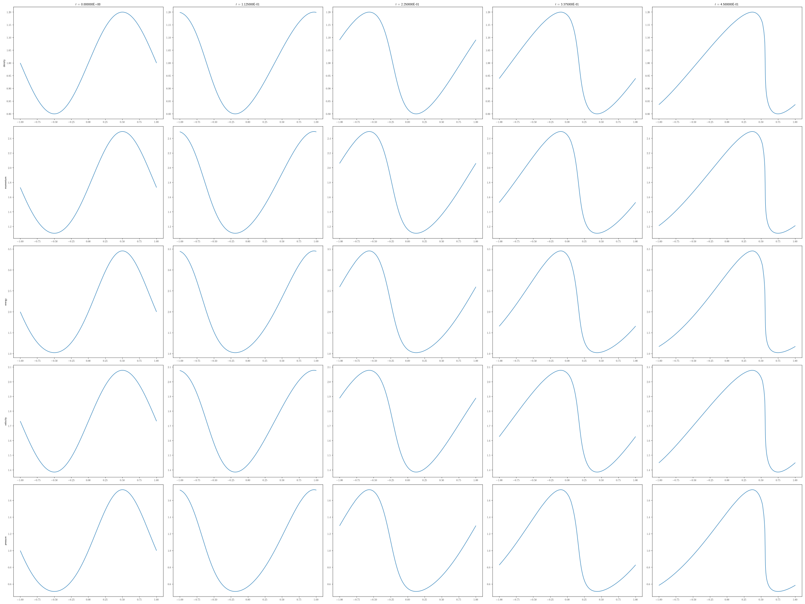

## `sod`

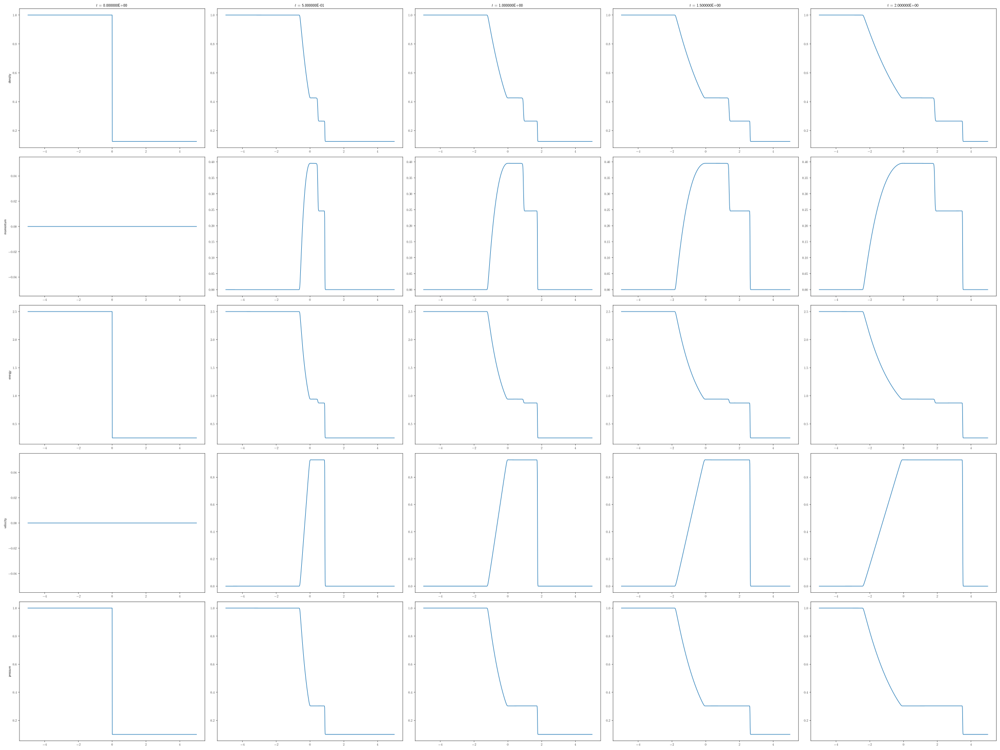

## `lax`

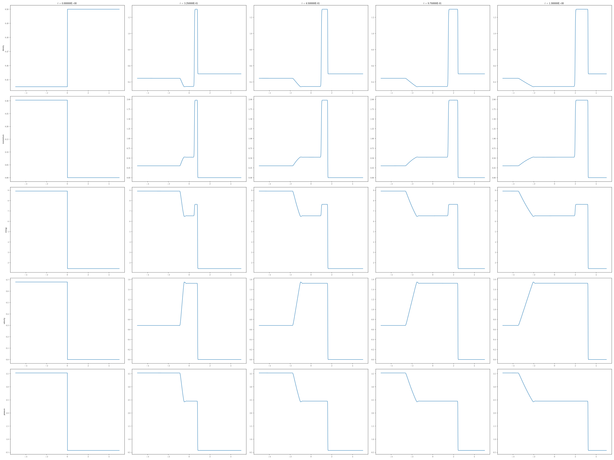

## `leblanc`

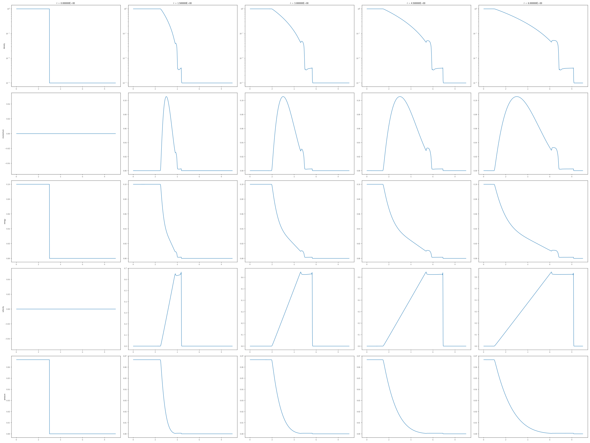

## `two_rarefaction`

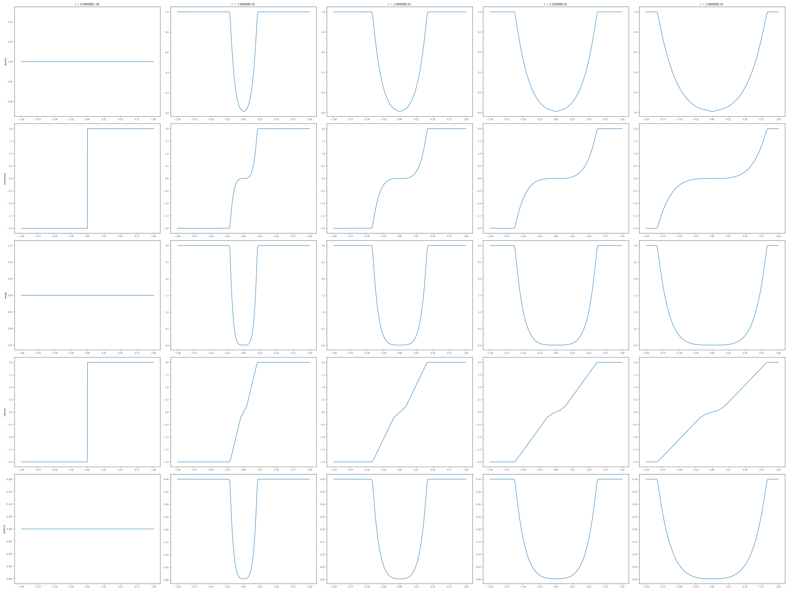

## `sedov_1959`

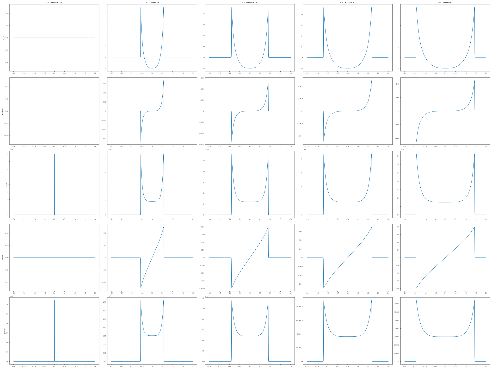

## `woodward_colella_1984`

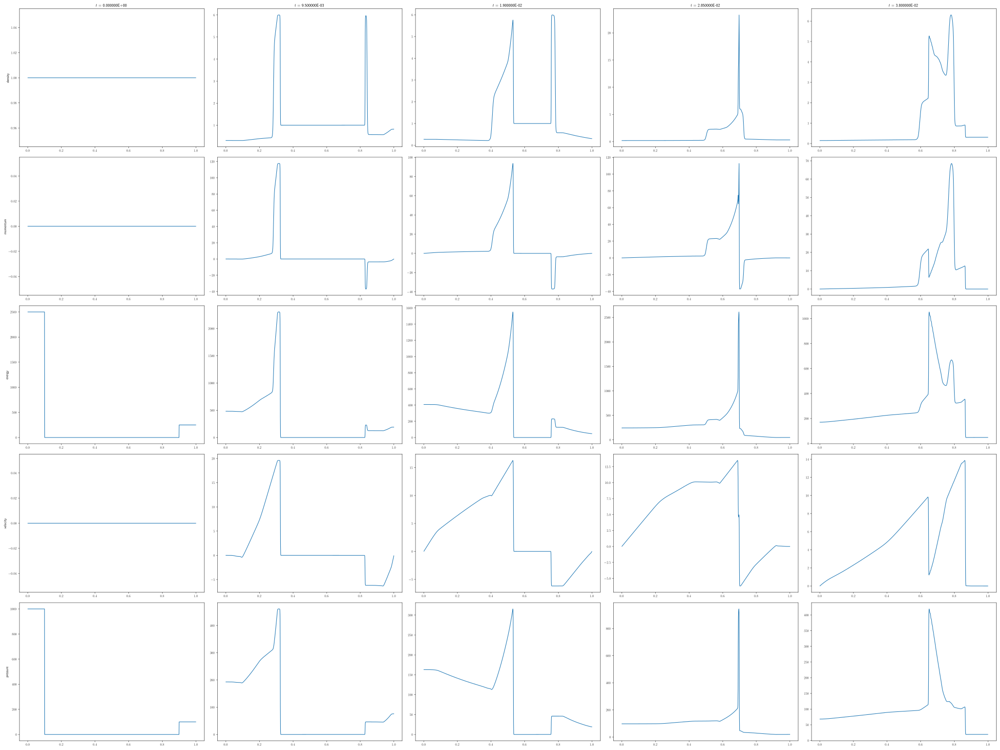

## `shu_osher_1989`

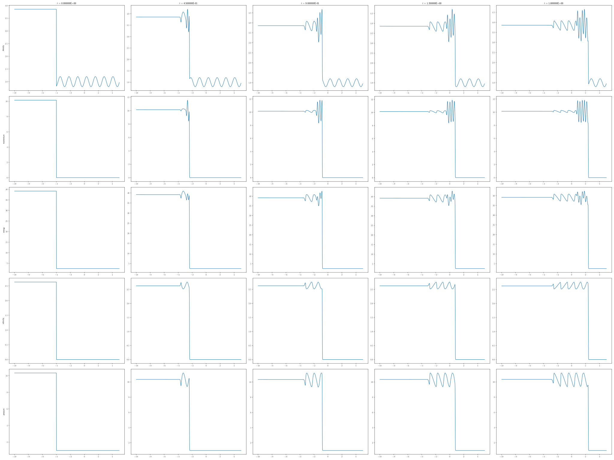

## `shu_osher_1996`

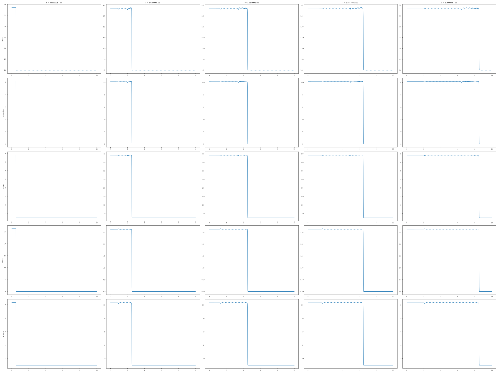

## `linde_roe_1997`

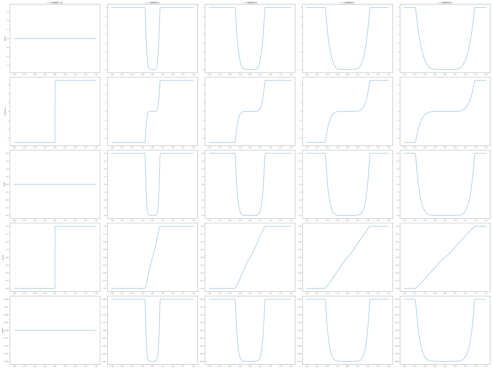

## `titarev_toro_2004`

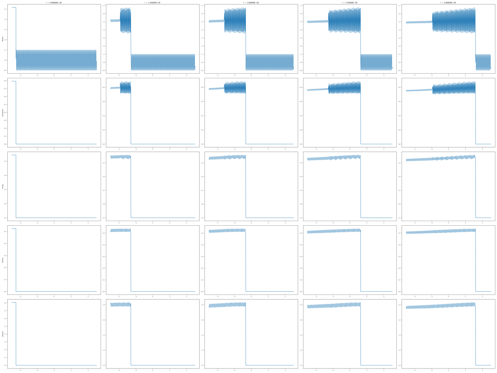
